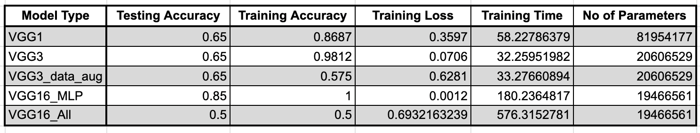
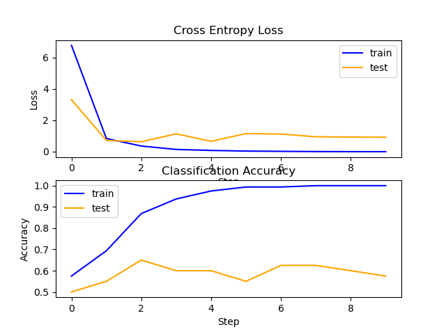
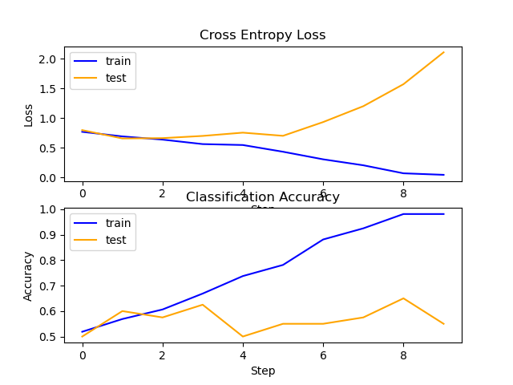
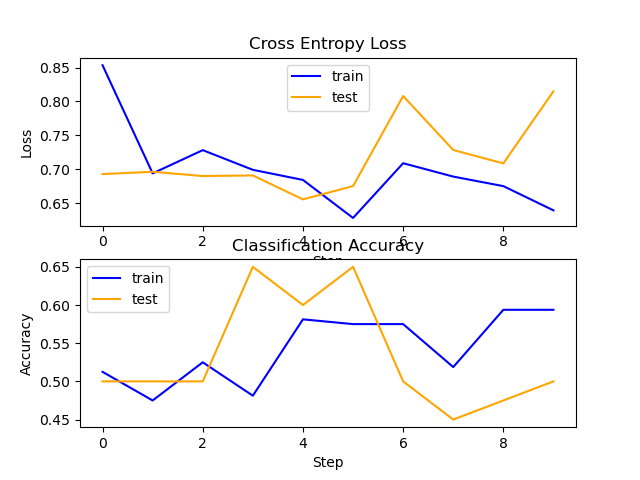
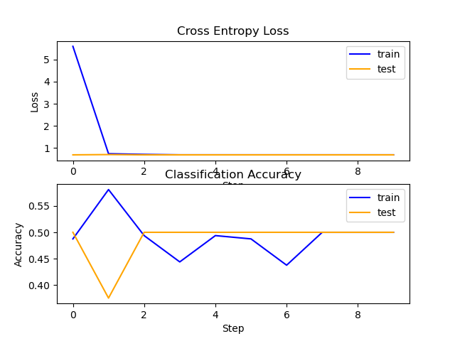
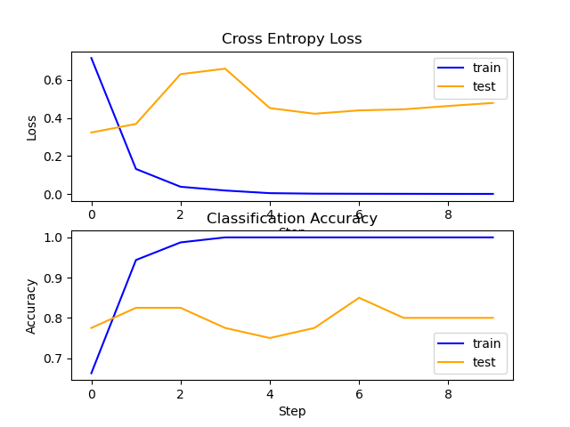

# assignment-4-es-335-2024-random-forest

### *Expected result for the models based on their testing accuracy:*

#### VGG16_MLP > VGG16_All > VGG3_DataAugmentation > VGG3 > VGG1
---
### * Observed Result: *

- As expected, the VGG16 model with only MLP fine-tuning works better than VGG3 or VGG1 models. This is due to using already learnt weights of the very accurate pre-trained VGG16 model on the "imagenet" dataset.
- We also expect that the VGG16 having fine-tuning in only FCN layers would perform better than fine-tuning all layers including convolutional layers because our dataset is extremely small to fine-tune the convolutional layer and learn useful information from it. Hence, if we try to fine-tune the convolutional layers then the parameter weights change but not in the betterment and hence reduce the performance than just fine-tuning the FCN layers.
- The contradiction observed in the order is as follows: VGG1 = VGG3 = VGG3_DataAugmentation > VGG16_All
- Possible Reason: The extremely small dataset meant that the weights could not be learnt very well and hence the testing accuracy is same for all VGG models except VGG16_All irrespective of the structure of the model. However the training accuracy can be different for all models.
- One another reason might be the many images consisting of multiple kangaroos/sheeps in them instead of one. This results in confusion within the model as the background remains same for both animals and there is relatively little useful information across images which can distinctively conclude the classes. 
- The training time follows the order as expected. VGG16 takes most time as there are 13 Convolutionals layers and 3 Dense layers in it. VGG1 takes more time VGG3 because it has more parameters than VGG3 whereas both VGG3 models takes almost same time irrespective of Data Augmentation becuase the trainable parameters remains same in them.
---
- Data Augmentation even though increases the number of images in the dataset, still does not provide with extensive dataset for us to work with and hence it doesn't improve our performance.
---
- Increasing the number of epochs from 1 to 5 increases the accuracy across the models. However, increasing the epochs above this does not improve the accuracy significantly. The possible reason for this must be that the training accuracy is already around 0.95 to 1 at epoch ~5 and hence their is no scope of betterment in the model from here and as a result, the test accuracy does not increase even after increasing epochs afterwards.
---
- The model is often confused where the images are too small or the animal covers very small area or in other words, the background is prominent in the image. This confuses the modek as there is little information to conclusively conclude the class of the animal.
---
### MLP Performance
- *Training time:  7.0058488845825195*
- *Training accuracy:  0.512499988079071*
- *Training loss:  1.4311714172363281*
- *Testing accuracy:  0.6499999761581421*
- *No. of parameters:  30784193*
- The MLP performs better than VGG3 models but is poor than VGG1 and VGG16 fine-tuned on MLP layers. From this we can conclude that the models having lower no. of parameters(except pre-trained VGG16) are performing poorly than the models having high parameters.
---

---

---

---

---

